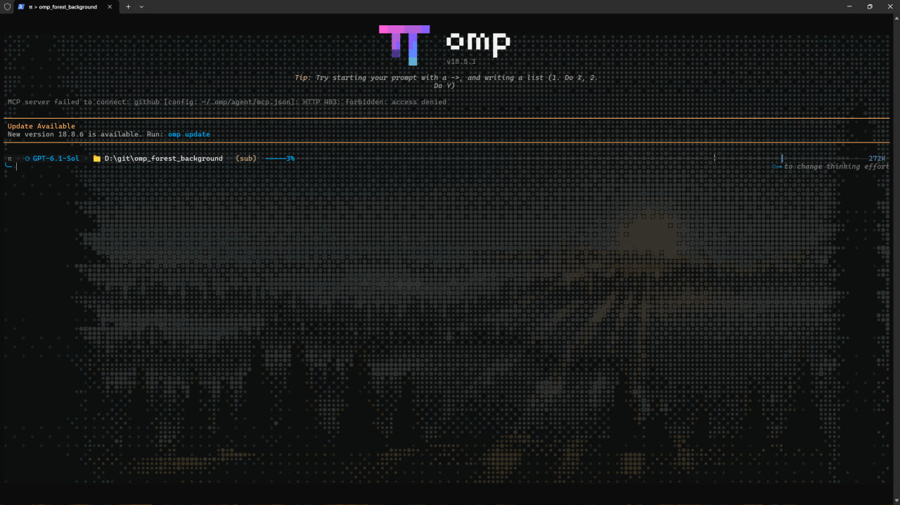

# omp forest background

Один плагин с анимированным [misty forest](https://ascii.rest/misty-forest/) для **Windows Terminal и iTerm2**. Версия 3.0 выбирает бэкенд автоматически:

| Терминал | Реализация | Область действия |
| --- | --- | --- |
| Windows Terminal, Windows | GPU-шейдер HLSL, интерполяция кадров | Все окна и вкладки выбранного профиля |
| iTerm2, macOS | Нативные фоновые PNG, смена кадров через AppleScript до 2 кадров/с | Настройка конкретной сессии/панели по `ITERM_SESSION_ID`; отображение зависит от настройки отдельных фонов панелей |

Это не `imgcat`, не картинка в строках и не ANSI-дорисовка пустых областей. Фон рисует сам терминал за своей историей. По умолчанию: яркость **16%**, анимация включена. Используются 64 кадра оригинального генератора @bas3line; движение проходит вперёд и обратно, без скачка между концами цикла. Всё работает локально, без сети и запросов к модели.



Скриншот работы плагина в Windows Terminal.

## Что нужно перед установкой

Нужны **omp 18.5.1 или новее**, **Node.js LTS с npm** и подходящий терминал:

| Система | Где запускать | Что не подходит |
| --- | --- | --- |
| Windows | Windows Terminal 1.22+; PowerShell внутри его вкладки | Старый Console Host, терминалы других приложений |
| macOS | Локальный iTerm2; рекомендуется актуальная стабильная версия | Apple Terminal, другие терминалы, запуск плагина на удалённой машине по SSH |

Node/npm нужны для установки единственной runtime-зависимости `jsonc-parser`. Исполнение TypeScript обеспечивает omp. Для обычного использования плагина отдельно устанавливать Bun, Python, Rust или компилятор HLSL не требуется.

Если omp, Node и терминал уже установлены, пропустите их установку ниже. Код плагина общий для обеих систем: используется **корень этого репозитория**, где лежат `package.json`, `index.ts`, `src` и `assets`. Для клонирования и обновления нужен Git; если полная папка проекта уже есть, её можно подключить напрямую.

## Установка на Windows

Все команды этого раздела выполняются **в PowerShell, открытом внутри Windows Terminal**. Не открывайте для этого отдельное окно старого Console Host.

### 1. Установите зависимости, если их ещё нет

Windows Terminal можно установить из Microsoft Store. Если доступен `winget`, альтернативный способ:

```powershell
winget install --id Microsoft.WindowsTerminal --exact
```

Установите **Node.js LTS** с [официального сайта](https://nodejs.org/en/download), оставив установку npm и добавление в `PATH`. Либо используйте:

```powershell
winget install --id OpenJS.NodeJS.LTS --exact
```

Для клонирования установите [Git for Windows](https://git-scm.com/downloads/win) или, если доступен `winget`:

```powershell
winget install --id Git.Git --exact
```

Если omp ещё не установлен, [официальная команда проекта](https://github.com/can1357/oh-my-pi#install):

```powershell
irm https://omp.sh/install.ps1 | iex
```

Эта команда скачивает и исполняет официальный установщик omp. Запускайте её только если доверяете этому источнику.

После установки полностью закройте Windows Terminal и откройте снова, чтобы он получил обновлённый `PATH`. Проверьте доступность программ:

```powershell
node --version
npm.cmd --version
omp --version
git --version
```

Здесь и далее используется `npm.cmd`: это штатная обёртка npm для Windows, которая не требует разрешать запуск `npm.ps1` или ослаблять PowerShell Execution Policy.

### 2. Клонируйте репозиторий в постоянную папку

Клонируйте репозиторий в `%USERPROFILE%\omp-forest`:

```powershell
git clone https://github.com/Arkuda/omp_forest_background.git "$HOME\omp-forest"
```

Дождитесь успешного завершения `git clone`. Если папка уже существует и содержит файлы, Git не перезапишет её: используйте другую новую папку или инструкцию обновления ниже.

Если полная папка проекта уже есть, клонирование не нужно. На следующем шаге перейдите в её корень вместо `$HOME\omp-forest`.

### 3. Установите зависимость и подключите папку к omp

```powershell
Set-Location "$HOME\omp-forest"
npm.cmd install --omit=dev
omp plugin link "$PWD"
```

При установке из уже существующей папки замените только путь в `Set-Location` на свой. Подключайте именно корень проекта, а не `src` или `assets`.

Дождитесь успешного завершения `npm.cmd install`, затем выполняйте `plugin link`. Подключение по умолчанию действует для пользователя во всех проектах. **Не удаляйте и не перемещайте эту папку после подключения:** `link` создаёт ссылку на неё, а не копию плагина.

### 4. Запустите omp и проверьте фон

Если omp уже был запущен, выйдите из старого процесса через `/exit`. После этого в той же вкладке Windows Terminal:

```powershell
omp
```

Фон включается автоматически. Внутри omp можно проверить команды `/forest still`, `/forest animate`, `/forest brightness 8` и `/forest off`. Это команды интерфейса omp, **не PowerShell**.

### 5. Если профиль не определился автоматически

Обычно Windows Terminal передаёт `WT_PROFILE_ID`. Проверить переменную в PowerShell:

```powershell
$env:WT_PROFILE_ID
```

При запуске PowerShell из Проводника переменной может не быть. Плагин не угадывает `defaultProfile`: откройте **Windows Terminal → Settings → Open JSON file**, найдите в `profiles.list` профиль именно текущей вкладки и скопируйте его `guid`.

Например, если текущая вкладка использует стандартный профиль **Windows PowerShell** с этим GUID:

```powershell
omp --forest-profile "{61c54bbd-c2c6-5271-96e7-009a87ff44bf}"
```

**Это не универсальный GUID для любого PowerShell.** У PowerShell 7, cmd и пользовательских профилей он может быть другим. Чужой GUID направит фон в чужой профиль.

Если установлены Stable и Preview или настройки не найдены однозначно, укажите ещё и их файл:

```powershell
$SettingsPath = Join-Path $env:LOCALAPPDATA "Packages\Microsoft.WindowsTerminal_8wekyb3d8bbwe\LocalState\settings.json"
omp --forest-profile "{GUID_ТЕКУЩЕГО_ПРОФИЛЯ}" --forest-settings $SettingsPath
```

Путь выше относится к обычной установке Stable из Store. Для Preview и переносной версии возьмите реальный путь к их `settings.json`, а не копируйте этот путь вслепую.

**Особенность Windows:** шейдер действует на все окна и вкладки выбранного профиля, не только на omp. Для изоляции создайте отдельный профиль Windows Terminal для omp. Существующий пользовательский шейдер плагин не перезаписывает.

## Установка на macOS

Все действия с плагином и запуск omp выполняются **в локальном окне iTerm2**.

### 1. Установите зависимости, если их ещё нет

Установите актуальный стабильный [iTerm2](https://iterm2.com/downloads.html) в Applications. Используются AppleScript API, документированные для iTerm2 3.4 и новее.

Установите **Node.js LTS** с [официального сайта](https://nodejs.org/en/download); npm входит в установку. Если Homebrew уже установлен, можно вместо этого выполнить:

```sh
brew install node
brew install --cask iterm2
```

Проверьте `git --version`. Если Git отсутствует, установите Command Line Tools командой `xcode-select --install` и завершите установку в открывшемся окне; полный Xcode не нужен. При использовании Homebrew можно вместо этого выполнить `brew install git`.

Для omp выберите **один** способ. [Официальный установщик](https://github.com/can1357/oh-my-pi#install):

```sh
curl -fsSL https://omp.sh/install | sh
```

Или, если используете Homebrew:

```sh
brew install can1357/tap/omp
```

Команда `curl ... | sh` скачивает и исполняет официальный установщик. Выполняйте её только если доверяете источнику; устанавливать omp повторно другим способом не нужно.

Откройте новое окно iTerm2 и проверьте программы:

```sh
node --version
npm --version
omp --version
git --version
```

При установке готового бинарника omp официальный скрипт по умолчанию использует `~/.local/bin`. Если пишет `omp: command not found`, для текущего окна:

```sh
export PATH="$HOME/.local/bin:$PATH"
omp --version
```

Чтобы путь сохранился, добавьте строку `export PATH="$HOME/.local/bin:$PATH"` в `~/.zshrc`, если используете стандартный zsh. При установке через Homebrew или Bun путь может быть другим — следуйте выводу своего установщика.

### 2. Клонируйте тот же репозиторий

Клонируйте репозиторий в `~/omp-forest`:

```sh
git clone https://github.com/Arkuda/omp_forest_background.git "$HOME/omp-forest"
```

Дождитесь успешного завершения `git clone`. Если папка уже существует и содержит файлы, выберите другую новую папку или используйте инструкцию обновления. Если полная папка проекта уже есть, пропустите клонирование и на следующем шаге перейдите в её корень.

### 3. Установите зависимость и подключите плагин

```sh
cd "$HOME/omp-forest" &&
npm install --omit=dev &&
omp plugin link "$PWD"
```

Не запускайте `npm install` через `sudo`: папка находится в вашем домашнем каталоге. После `link` не удаляйте и не перемещайте папку. Если раньше уже подключили этот же путь, повторное подключение не требуется.

### 4. Разрешите управление iTerm2 и настройте фон

1. В iTerm2 откройте **Settings → Appearance → Panes** и включите **Separate background images per pane**, если используете split-панели. Без этой настройки iTerm2 может показывать общий фон окна, хотя плагин меняет свойство только своей сессии. Если в старой версии пункта нет, используйте отдельное окно без split-панелей либо обновите iTerm2.
2. В **Profiles → Window → Background Image** выберите **Scale to Fit**, чтобы сохранить пропорции и оба крайних дерева. Плагин не меняет ваш режим: Stretch растягивает сцену, Scale to Fill обрезает края.
3. Оставьте тёмную тему. **Blending** дополнительно смешивает изображение с цветом терминала; если лес почти не виден, передвиньте ползунок в сторону изображения. Плагин этот параметр не перезаписывает.
4. Закройте старый процесс omp через `/exit`, если он был открыт, и запустите:

```sh
omp
```

5. Если macOS попросит разрешить управление iTerm2, нажмите **Allow / Разрешить**. При отказе откройте **System Settings → Privacy & Security → Automation** и разрешите приложению, запускающему omp, управление iTerm2. Если запрос уже завершился ошибкой, после выдачи разрешения выполните в omp `/forest off`, затем `/forest on`.

Python, `pip` и включение Python API не нужны. Плагин использует штатный `/usr/bin/osascript`. AppleScript API iTerm2 находится в maintenance mode; использованные свойства фона и идентификатора сессии официально документированы.

### 5. Проверьте, что omp запущен в нужной панели

Если плагин жалуется на отсутствующий `ITERM_SESSION_ID`, проверьте в оболочке iTerm2, до запуска omp:

```sh
printf 'TERM_PROGRAM=%s\nITERM_SESSION_ID=%s\n' "$TERM_PROGRAM" "$ITERM_SESSION_ID"
```

Ожидаются `TERM_PROGRAM=iTerm.app` и непустой `ITERM_SESSION_ID`, содержащий UUID панели. Не подставляйте эти переменные вручную и не копируйте их из другой вкладки. Запустите omp непосредственно в новой локальной панели iTerm2. В случае SSH или унаследованного окружения tmux идентификатор может отсутствовать или указывать не на нужную сессию; плагин не выбирает активную панель как запасной вариант.

На Mac анимация — смена нативных фоновых PNG **до 2 кадров/с**, а не GPU-шейдер Windows Terminal. При первом включении создаются 64 изображения 1200×600 во временной папке; при смене яркости — новый набор. Генерация асинхронная. После успешного восстановления файлы удаляются; при неоднозначной ошибке или ручной смене картинки могут сохраняться, чтобы не сломать действующий путь.

## Однократный запуск без подключения

Если не хотите устанавливать постоянную ссылку, сначала установите зависимость из папки плагина. Затем:

Windows, PowerShell:

```powershell
omp --no-extensions -e "$HOME\omp-forest"
```

macOS, iTerm2:

```sh
omp --no-extensions -e "$HOME/omp-forest"
```

`--no-extensions` отключает другие автоматически подключаемые расширения только для этого запуска; явный `-e` загружает этот плагин. Если ссылка уже установлена, для обычной работы достаточно `omp`. Windows-флаги `--forest-profile` и `--forest-settings` при необходимости добавляются и к запуску через `-e`.

После установки не нужно находиться в папке плагина: можно запускать omp из любого рабочего проекта. Нужен интерактивный интерфейс omp, а не print/RPC-режим.

## Управление — одинаковое на обеих платформах

| Команда | Действие |
| --- | --- |
| `/forest` | Включить / выключить фон |
| `/forest on` | Включить фон с выбранными параметрами |
| `/forest off` | Остановить анимацию и восстановить исходные настройки фона |
| `/forest still` | Остановить анимацию и показать начальный кадр сцены |
| `/forest animate` | Включить анимацию |
| `/forest brightness 8` | Установить яркость, 1–30%; не включает выключенный фон |

Параметры сохраняются при переключении сессии внутри процесса. При новом запуске возвращаются значения по умолчанию. При обычном выходе, в том числе через `/exit`, фон восстанавливается. RPC, print и дочерние агенты фон не включают. Другие терминалы получают понятное предупреждение; ANSI-подмена не используется.

## Обновление, отключение и удаление

**Обновление клона:** сначала выполните `/forest off` и `/exit` во всех процессах, которые используют этот фон. Затем в подключённой папке:

Windows, PowerShell:

```powershell
Set-Location "$HOME\omp-forest"
git pull --ff-only
if ($LASTEXITCODE -eq 0) { npm.cmd install --omit=dev }
```

macOS:

```sh
cd "$HOME/omp-forest" &&
git pull --ff-only &&
npm install --omit=dev
```

После успешного обновления снова запустите omp. Повторный `plugin link` для того же пути не нужен. Если клонировали в другую папку, используйте её путь. `--ff-only` не создаёт merge-коммит: при локальных изменениях или разошедшейся истории сначала разберите ошибку Git, не удаляя свою работу.

**Папка без Git:** после штатного выхода обновите её содержимое из проекта, сохранив весь `src` и `assets`, и повторите runtime-установку npm. Если вместо этого подключаете новую папку, установите в ней зависимость и выполните `omp plugin link` с новым путём. Старую папку можно убирать только после выхода из старого процесса и подключения новой.

**Временно остановить фон:** `/forest off`. После нового запуска omp фон снова включится по умолчанию. `/forest still` оставляет картинку, но останавливает анимацию.

**Удалить подключение:** сначала `/forest off` и `/exit` в каждом процессе, который использует этот фон. В проверенной версии omp 18.5.1 команда удаления вызывает внешний `bun`: если он не установлен, сначала установите его по [официальной инструкции Bun](https://bun.sh/docs/installation) и откройте новое окно терминала. Это зависимость команды плагин-менеджера, не самого фона. Затем в оболочке:

```sh
omp plugin uninstall omp-forest-background
```

После успешного удаления подключения папка исходного плагина больше не нужна omp. Удаление подключения не заменяет штатный выход: работающий процесс не выгружает плагин автоматически.

Если хотите только отключить автоматическую загрузку без удаления ссылки, после штатного выхода можно выполнить:

```sh
omp plugin disable omp-forest-background
```

Вернуть загрузку:

```sh
omp plugin enable omp-forest-background
```


## Если что-то не работает

| Симптом | Что проверить |
| --- | --- |
| `node`, `npm` или `omp` не найдены | Установку и `PATH`; после установки на Windows перезапустите весь Windows Terminal, на Mac проверьте путь, напечатанный установщиком |
| PowerShell запрещает `npm.ps1` | Используйте `npm.cmd`, не меняя глобальную Execution Policy |
| `plugin uninstall`: `Executable not found in $PATH: "bun"` | В этой версии менеджеру плагинов нужен внешний Bun; установите его и перезапустите терминал либо пока отключите загрузку через `plugin disable` |
| Не найден `package.json` | Перейдите в корень клона `.../omp-forest` или своей папки проекта, где лежит этот файл; вложенной папки `package` нет |
| Не найден модуль `jsonc-parser` | Выполните runtime-установку npm из той же папки, на которую указывает `plugin link` |
| `/forest` не распознаётся или неизвестен флаг `--forest-profile` | Перезапустите omp после подключения; убедитесь, что ссылка указывает на папку с `package.json` и `index.ts` |
| Windows: отсутствует `WT_PROFILE_ID` | Укажите реальный GUID текущего профиля через `--forest-profile`, как описано выше |
| Windows: не найден файл настроек | Передайте реальный `settings.json` через `--forest-settings`; не смешивайте пути Stable и Preview |
| Windows: уже есть пользовательский шейдер | Используйте отдельный профиль или вручную отключите конфликтующий шейдер; плагин не будет его перетирать |
| Mac: отказ Automation или тайм-аут | Разрешите управление iTerm2, проверьте запрос macOS и отзывчивость приложения; затем `/forest off` → `/forest on` |
| Mac: нет нужного UUID панели | Проверьте переменные в локальном iTerm2; не запускайте через SSH и не подменяйте идентификатор |
| Mac: фон не виден или относится ко всему окну | Проверьте тёмную тему, Blending и Separate background images per pane |
| Картинка есть, но не движется | Выполните `/forest animate`; на iTerm2 движение ограничено скоростью Apple Events и 2 кадрами/с |
| Сообщение `Another forest controller owns...` | Другой процесс уже управляет этим профилем/панелью; выключите фон там или завершите его штатно |
| Сообщение о смене картинки/полей извне | Сначала `/forest off`, затем `/forest on`, если хотите заново включить фон; обнаруженные ручные изменения сохраняются |

Если процесс был принудительно завершён и осталась папка владения `*.lock`, не удаляйте её вслепую. Сначала убедитесь, что старый процесс завершён, восстановите настройки по разделу ниже и удалите **только** путь, указанный в сообщении плагина. Не удаляйте весь каталог настроек терминала или чужие фоновые файлы.

Безопасная предварительная проверка подключения, не меняющая реестр плагинов:

```sh
omp plugin link "/полный/путь/к/плагину" --dry-run
```

Это проверка формы команды/предпросмотр, не полноценный запуск фона. Для фактической проверки запустите omp в подходящем терминале и используйте команды `/forest`.


## Сохранность настроек и ограничения

### iTerm2

Меняется только `background image` конкретной сессии. Цвета, прозрачность, глобальные настройки, общие профили, режим и blending не меняются. Предыдущая картинка, включая пустой путь, восстанавливается при выключении. Повторное включение запоминает новую исходную картинку и цвет фона.

Владение панелью защищено отдельной `omp-forest-iterm-<uid>-<UUID>.lock` папкой во временном каталоге. Вложенная/вторая сессия не перетирает первый контроллер. Таймер останавливается до восстановления, выполняющийся запрос завершается перед ним. Ручная смена картинки останавливает анимацию с уведомлением; `/forest off` сохраняет обнаруженное пользовательское изменение. Apple Events не дают атомарной compare-and-swap операции: одновременное изменение внутри короткого промежутка между чтением и записью нельзя гарантированно защитить.

При отказе Automation или тайм-ауте нет фиктивного успеха. Если сеттер мог успеть применить путь, файлы сохраняются до выяснения состояния. После исправления причины выполните `/forest off`, затем `/forest on`. Принудительное завершение процесса не выполняет восстановление: при необходимости вручную верните картинку панели и удалите **только** папку владения, указанную в ошибке; закрытие панели также завершает её временные изменения.

### Windows Terminal

Шейдер принадлежит профилю, не отдельной вкладке. Для изоляции используйте отдельный профиль для omp. Меняются только `experimental.pixelShaderPath` и `experimental.pixelShaderImagePath` выбранного элемента `profiles.list`; `profiles.defaults`, другие профили, комментарии и сторонние настройки сохраняются. Существующий пользовательский шейдер, включая унаследованный, не заменяется. Один профиль одновременно контролирует только одна сессия.

При восстановлении изменённые пользователем поля сохраняются. Атлас, варианты шейдера и владение находятся рядом с `settings.json`, в `omp-forest-assets`. Варианты остаются на диске, чтобы пути работали после аварии. Перед первым использованием сохраните копию `settings.json`. После принудительного завершения верните прежние значения двух полей либо удалите добавленные поля, если их раньше не было; затем удалите только указанную папку `*.lock`.

### Читаемость

Рассчитано на тёмную тему. Windows-шейдер добавляет сцену к тёмным пикселям кадра; яркие пиксели текста не меняются, но очень тёмные пиксели текста или изображений могут получать тот же слой. iTerm2 смешивает фон своим нативным рендерером и выбранным blending. Геометрия текста, курсор, выделение и содержимое истории плагином не переписываются. Экспорты и текстовые логи не включают графический слой.

Анимация расходует ресурсы: для экономии используйте `/forest still` или `/forest off`. Если Windows Terminal отклонит HLSL, он покажет предупреждение; `/forest off` восстанавливает настройки.

## Разработка и проверка

Для разработки выполните команды в корне репозитория. Здесь устанавливаются также dev-зависимости, включая Bun и TypeScript; для обычного использования проверки и генерация не нужны.


```sh
npm install
npm run check
npm test
npm run generate:assets
```

Готовые `assets/forest-atlas.png`, `assets/forest.hlsl` и `assets/iterm-background.applescript` уже входят в репозиторий — перед использованием генерировать их не нужно. Windows-шаблон находится в `assets/forest.template.hlsl`; после его изменения регенерируйте файлы. PNG-кодек общий для сборки атласа и генерации iTerm2-кадров.

**Проверено на Windows:** типы, 23 теста (JSONC, изображения, выбор панели, восстановление, таймеры и гонки), генерация и визуальный просмотр настоящих PNG, загрузка объединённого плагина в omp 18.5.1, команды still/brightness/off/on/animate и выход через `/exit` с восстановлением отдельного файла настроек. После извлечения общего PNG-кодека Windows-атлас и HLSL регенерируются байт-в-байт без изменений. GPU-анимация этого Windows-шейдера ранее проверена на реальном окне Windows Terminal 1.22.11141.0.

**Ограничение проверки:** на этой машине нет macOS. Нативный AppleScript, разрешение Automation, фактическая скорость и отображение фона в iTerm2 здесь не запускались. Тесты iTerm2-контроллера используют stateful-модель границы Apple Events и не заменяют проверку на Mac.

Исходник сцены зафиксирован на [bas3line/ascii@3742627](https://github.com/bas3line/ascii/blob/3742627981f86355c22660d994eef5bb992bb073/src/pieces/misty-forest.ts). Изменены только локальные объявления типов. Лицензия: `src/vendor/LICENSE` (MIT, © 2026 bas3line).

Первичные API: [Windows Terminal pixel shader](https://learn.microsoft.com/en-us/windows/terminal/customize-settings/profile-appearance#pixel-shader-path), [официальный AppleScript iTerm2](https://iterm2.com/3.4/documentation-scripting.html), [настройки фоновых изображений iTerm2](https://iterm2.com/documentation-preferences-profiles-window.html), [словарь iTerm2](https://github.com/gnachman/iTerm2/blob/master/iTerm2.sdef).
